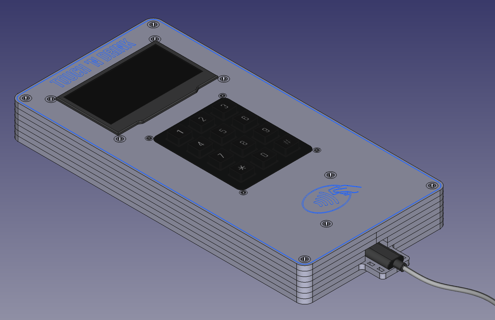

# LSC Touch 'n Drink

Touch 'n Drink is a small device that reads NFC id cards of club members of the [Aeroclub Hamm] and allows to pay for items like cold drinks offered at the clubhouse. Purchases are forwarded to accounting so members pay via their regular monthly invoices. We're located at airfield [EDLH] in Hamm, Germany.

## Hardware

ESP32-C3, Keypad, OLED Display and NFC reader in a custom acrylic case. See [hardware] folder for details.

## Firmware

Written in [Rust]. See [firmware] folder for details.

## Contributions

If you like this project, want to use it at your club, or if you want to discuss ideas and suggestions, feel free to start a [discussion][discussions] or open an [issue][issues]. Feel free to fork this repository and base your work upon it. If you implement changes or features that can be useful for everyone, please open a pull request.

[hardware]: ./hardware
[firmware]: ./firmware

[discussions]: https://github.com/zargony/touch-n-drink/discussions
[issues]: https://github.com/zargony/touch-n-drink/issues

[Aeroclub Hamm]: https://flugplatz-hamm.de
[EDLH]: https://skyvector.com/airport/EDLH/Hamm-Lippewiesen-Airport
[Rust]: https://rust-lang.org
