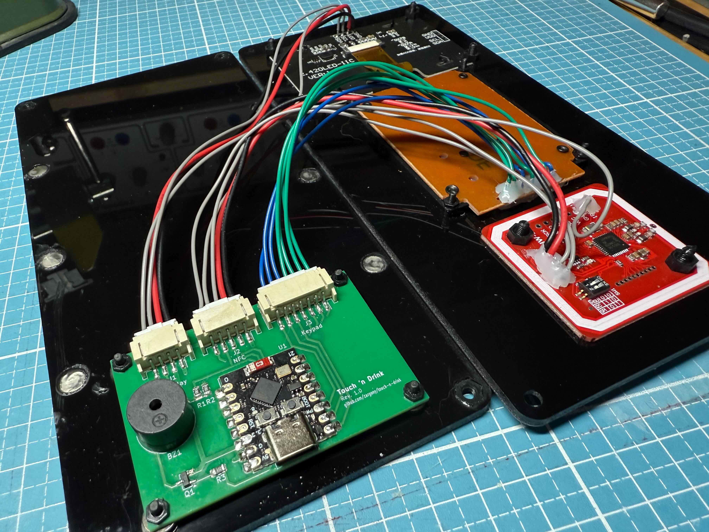

# Touch 'n Drink Hardware

Assembled device:

## Electronics

Wiring of parts:

Front components and connectors:

Prototype breadboard:

### Electronic Parts

- OLED display 2.42" I2C
  ([AliExpress](https://s.click.aliexpress.com/e/_DCysL8J)) <!-- https://www.aliexpress.com/item/1005006100836064.html -->
  ([Amazon](https://amzn.to/460m6Js)) <!-- https://www.amazon.de/module-128x64-driver-SSD1309-interface/dp/B0C745HXGB -->
  ([Model](https://grabcad.com/library/display-oled-2-42-1))
- Matrix 4x3 keypad
  ([AliExpress](https://s.click.aliexpress.com/e/_DEhcWpV)) <!-- https://www.aliexpress.com/item/1005005536316575.html -->
  ([Amazon](https://amzn.to/3Y1Twpa)) <!-- https://www.amazon.de/HALJIA-Tastatur-Membran-kompatibel-Arduino/dp/B08BBXH6NM -->
  ([Model](https://grabcad.com/library/keypad-3x4-w-pcb-1))
- PN532 NFC module v3
  ([AliExpress](https://s.click.aliexpress.com/e/_DFyKykT)) <!-- https://www.aliexpress.com/item/1005005973913526.html -->
  ([Amazon](https://amzn.to/3S3gAjo)) <!-- https://www.amazon.de/Diyeeni-Funkmodul-Reader-Android-Communication-default/dp/B07V5QDMR4 -->
  ([Model](https://grabcad.com/library/pn532-nfc-rfid-module-v3-kits-1))
- ESP32-C3 SuperMini
  ([AliExpress](https://s.click.aliexpress.com/e/_DdYM4t9)) <!-- https://www.aliexpress.com/item/1005005967641936.html -->
  ([Amazon](https://amzn.to/4bCXYxz)) <!-- https://www.amazon.de/iHaospace-ESP32-C3-Mini-Entwicklungboard-ESP32-C3FN4/dp/B0D1Y5CPLX -->
  ([Model](https://grabcad.com/library/esp32c3-supermini-1))

## PCB

A custom PCB holds the ESP32-C3 Module, a buzzer and connectors to wire up display, keypad and NFC reader. The PCB is quite simple and should be easy to manufacture. Choose any manufacturer you like.

If you don't want to manufacture a PCB, it's also easily possible to wire up everything on a perfboard (see below).

PCB Layout:

Rendered PCB model:

Alternatively: Wire everything up on a perfboard:

### Electronic PCB Components

- 60x40 mm custom 2-layer PCB
- 1x Passive buzzer, THT, 12085
- 1x S8550, SMT, TSOT-23 (or other generic NPN transistor, BEC pin ordering)
- 1x 1k resistor, SMT, 0805
- 2x 5k resistor, SMT, 0805
- 1x 4-pin JST PH header, SMT, horizontal, S4B-PH-SM4-TB
- 1x 5-pin JST PH header, SMT, horizontal, S5B-PH-SM4-TB
- 1x 7-pin JST PH header, SMT, horizontal, S7B-PH-SM4-TB

### Alternative Perfboard Components (optional, instead of PCB)

Instead of manufacturing a PCB, you can wire everything together on a 60x40 mm perfboard.

- Prototype PCB 60x40
  ([AliExpress](https://s.click.aliexpress.com/e/_Ddm12Wr)) <!-- https://www.aliexpress.com/item/1005006665029598.html -->
  ([Amazon](https://amzn.to/4eYnoIY)) <!-- https://www.amazon.de/Akozon-Leiterplatte-Doppelseiten-Prototyping-Universal/dp/B0B3MJ3WJM -->
  ([Model](https://grabcad.com/library/pcb-prototype-60x40-1))
- Passive buzzer module, 3.3V, active low
  ([AliExpress](https://s.click.aliexpress.com/e/_Dl2FWF1)) <!-- https://www.aliexpress.com/item/1005006316591026.html -->
  ([Amazon](https://amzn.to/3Y72Ibw)) <!-- https://www.amazon.de/Jopto-Passives-niedrigstufiges-Lautsprecher-Kompatibel/dp/B096ZWCG7F -->
  ([Model](https://grabcad.com/library/buzzer-module-fc-07-1))
- Connectors for wiring to front panel (optional)
- Wires for soldering

## Case

Lasercut acrylic sheets:

Prototype cardboard case:

Rendered CAD model:

### Hardware Parts

- Acrylic sheets, 3mm
- 8x M2x10 screws, countersunk, Nylon
  ([AliExpress](https://s.click.aliexpress.com/e/_Dnqr099)) <!-- https://www.aliexpress.com/item/1005006947644936.html -->
  ([Amazon](https://amzn.to/4bAfO4o)) <!-- https://www.amazon.de/CONPHERON-Kreuzschlitz-Senkschrauben-Kunststoff-Maschinenschrauben/dp/B09NXRQFHX -->
  ([Model](https://wiki.freecad.org/Fasteners_Workbench))
- 6x M3x10 screws, countersunk, Nylon
  ([AliExpress](https://s.click.aliexpress.com/e/_Dnqr099)) <!-- https://www.aliexpress.com/item/1005006947644936.html -->
  ([Amazon](https://amzn.to/4bAfO4o)) <!-- https://www.amazon.de/CONPHERON-Kreuzschlitz-Senkschrauben-Kunststoff-Maschinenschrauben/dp/B09NXRQFHX -->
  ([Model](https://wiki.freecad.org/Fasteners_Workbench))
- 4x M3x20 screws, countersunk, Nylon
  ([AliExpress](https://s.click.aliexpress.com/e/_Dnqr099)) <!-- https://www.aliexpress.com/item/1005006947644936.html -->
  ([Amazon](https://amzn.to/4bAfO4o)) <!-- https://www.amazon.de/CONPHERON-Kreuzschlitz-Senkschrauben-Kunststoff-Maschinenschrauben/dp/B09NXRQFHX -->
  ([Model](https://wiki.freecad.org/Fasteners_Workbench))
- 8x M2 nuts, Nylon
  ([AliExpress](https://s.click.aliexpress.com/e/_DEIu5LN)) <!-- https://www.aliexpress.com/item/1005004307521473.html -->
  ([Amazon](https://amzn.to/4603OYy)) <!-- https://www.amazon.de/CONPHERON-Kunststoff-Sechskant-Schwarz-Sechskantmutter/dp/B09N1HN8QR -->
  ([Model](https://wiki.freecad.org/Fasteners_Workbench))
- 10x M3 nuts, Nylon
  ([AliExpress](https://s.click.aliexpress.com/e/_DEIu5LN)) <!-- https://www.aliexpress.com/item/1005004307521473.html -->
  ([Amazon](https://amzn.to/4603OYy)) <!-- https://www.amazon.de/CONPHERON-Kunststoff-Sechskant-Schwarz-Sechskantmutter/dp/B09N1HN8QR -->
  ([Model](https://wiki.freecad.org/Fasteners_Workbench))
- USB-C cable
  ([Model](https://grabcad.com/library/usb-c-with-flexed-cable-1))
