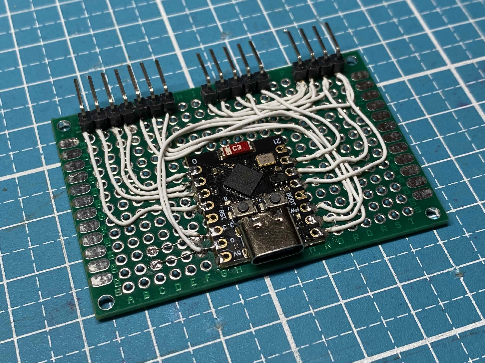

# Touch 'n Drink PCB

## Custom PCB

A custom PCB holds the ESP32-C3 Module, a buzzer and connectors to wire up display, keypad and NFC reader. The PCB is quite simple and easy to manufacture. Choose any manufacturer you like.

If you don't want to manufacture a PCB, it's also easily possible to wire up components on a perfboard (see below).

PCB Layout:

Rendered PCB model:

### Components

- 60x40 mm custom 2-layer PCB
- 1x ESP32-C3 SuperMini
  ([AliExpress](https://s.click.aliexpress.com/e/_DdYM4t9)) <!-- https://www.aliexpress.com/item/1005005967641936.html -->
  ([Amazon](https://amzn.to/4bCXYxz)) <!-- https://www.amazon.de/iHaospace-ESP32-C3-Mini-Entwicklungboard-ESP32-C3FN4/dp/B0D1Y5CPLX -->
  ([Model](https://grabcad.com/library/esp32c3-supermini-1))
- 1x Passive buzzer, THT, 12085
- 1x S8550, SMT, TSOT-23 (or other generic NPN transistor, BEC pin ordering)
- 1x 1k resistor, SMT, 0805
- 2x 5k resistor, SMT, 0805
- 1x 4-pin JST PH header, SMT, horizontal, S4B-PH-SM4-TB
- 1x 5-pin JST PH header, SMT, horizontal, S5B-PH-SM4-TB
- 1x 7-pin JST PH header, SMT, horizontal, S7B-PH-SM4-TB

## Perfboard (optional, instead of PCB)

Instead of manufacturing a custom PCB, you can wire up components on a 60x40 mm perfboard.

### Components

- Prototype PCB 60x40
  ([AliExpress](https://s.click.aliexpress.com/e/_Ddm12Wr)) <!-- https://www.aliexpress.com/item/1005006665029598.html -->
  ([Amazon](https://amzn.to/4eYnoIY)) <!-- https://www.amazon.de/Akozon-Leiterplatte-Doppelseiten-Prototyping-Universal/dp/B0B3MJ3WJM -->
  ([Model](https://grabcad.com/library/pcb-prototype-60x40-1))
- ESP32-C3 SuperMini
  ([AliExpress](https://s.click.aliexpress.com/e/_DdYM4t9)) <!-- https://www.aliexpress.com/item/1005005967641936.html -->
  ([Amazon](https://amzn.to/4bCXYxz)) <!-- https://www.amazon.de/iHaospace-ESP32-C3-Mini-Entwicklungboard-ESP32-C3FN4/dp/B0D1Y5CPLX -->
  ([Model](https://grabcad.com/library/esp32c3-supermini-1))
- Passive buzzer module, 3.3V, active low
  ([AliExpress](https://s.click.aliexpress.com/e/_Dl2FWF1)) <!-- https://www.aliexpress.com/item/1005006316591026.html -->
  ([Amazon](https://amzn.to/3Y72Ibw)) <!-- https://www.amazon.de/Jopto-Passives-niedrigstufiges-Lautsprecher-Kompatibel/dp/B096ZWCG7F -->
  ([Model](https://grabcad.com/library/buzzer-module-fc-07-1))
- Connectors for wiring to front panel (optional)
- Wires for soldering
